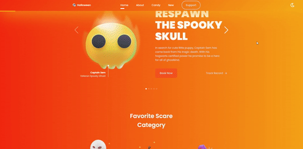

# Responsive-halloween-website

## 💻 Projeto

Responsive-halloween-website foi uma aplicação prática vista por mim em um canal do YouTube que acompanho [Bedimcode](https://www.youtube.com/c/Bedimcode), fiz uma Fork do projeto, a fim de codar junto e personalizar com meu jeitinho. Visite o GitHub do [Bedimcode](https://github.com/bedimcode/responsive-halloween-website). O mesmo é responsivo para as diferentes resoluções.

(<a href="#top">back to top</a>)

## 📢 Visite o site

[Responsive-halloween-website](https://lobinhodev.github.io/Responsive-halloween-website/).

(<a href="#top">back to top</a>)

## Pré-requisitos

-   `Git`
-   `SASS é opcional`

## Indicações

-   Clone meu repositório e faça uma Fork

### Comandos

| Comando                                                                    | O que faz?            | Observação               |
| -------------------------------------------------------------------------- | --------------------- | ------------------------ |
| `git clone https://github.com/lobinhodev/Responsive-halloween-website.git` | Clona meu repositório | **Execute no terminal!** |

### Desktop

  

## 🧠 Tecnologias

Esse projeto foi desenvolvido com as seguintes tecnologias:

-   HTML
-   CSS
-   JavaScript
-   SASS

(<a href="#top">back to top</a>)

Bibliotecas

-   [Google Fonts](https://fonts.google.com/)
-   [Swiperjs](https://swiperjs.com)
-   [UiGradient](https://uigradients.com)

(<a href="#top">back to top</a>)

## Referências

-   [W3Schools referência HTML](https://www.w3schools.com/tags/default.asp)
-   [W3Schools referência CSS](https://www.w3schools.com/cssref/default.asp)
-   [Google Fonts](https://fonts.google.com/)
-   [Coolors](https://coolors.co/palettes/trending)
-   [Paletton](https://paletton.com/)
-   [W3Schools propriedades CSS no DOM](https://www.w3schools.com/jsref/dom_obj_style.asp)
-   [MDN lista de eventos](https://developer.mozilla.org/en-US/docs/Web/Events)
-   [CSS BEM](https://desenvolvimentoparaweb.com/css/bem/)

(<a href="#top">back to top</a>)

---

Feito com ♥ by Lobinhodev 🐺
